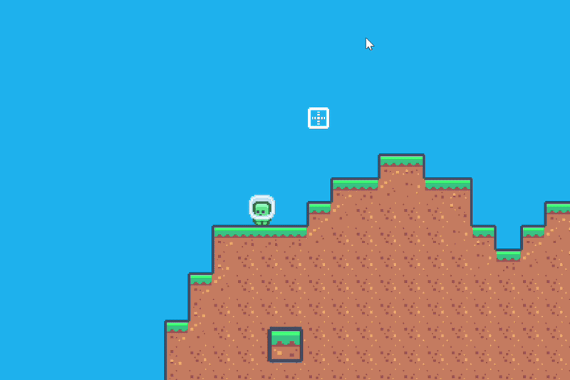

# Python platformer demo

This is a simple open-world platformer inspired by Terraria.
It is written with python and uses the pygame library.



## Controls

A, D : left-right movement  
SPACE : jump    
SHIFT : jump-cancel (dash down) 
E : dash    
LMB : break block   
RMB : place block   
SCROLL : switch material    

## Texture-packs

The texturepack system is pretty simple.
There is a file named **texturepacks.json**, this is the config file.
This is the syntax:
```
{
  "texturepacks":
          [
            {"folder": "assets/base", "tile_size": 18},
            {"folder": "assets/hd1", "tile_size": 540},
            {"folder": "assets/test", "tile_size": 720},
          ]
}
```


Textures from [Kenney](https://kenney.nl/).
